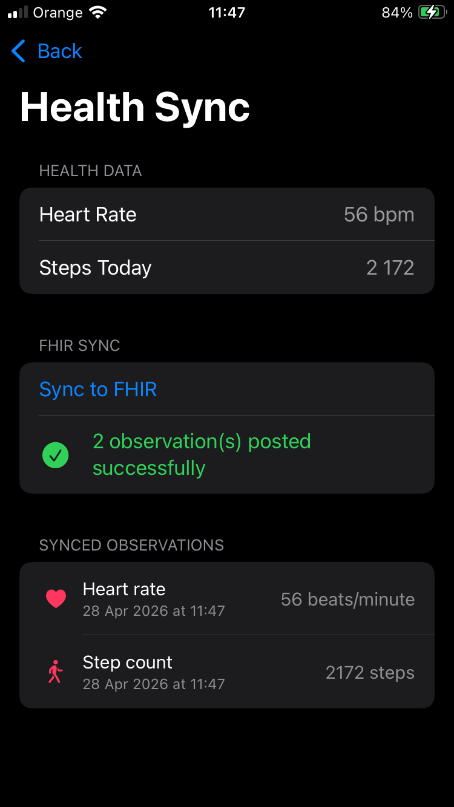
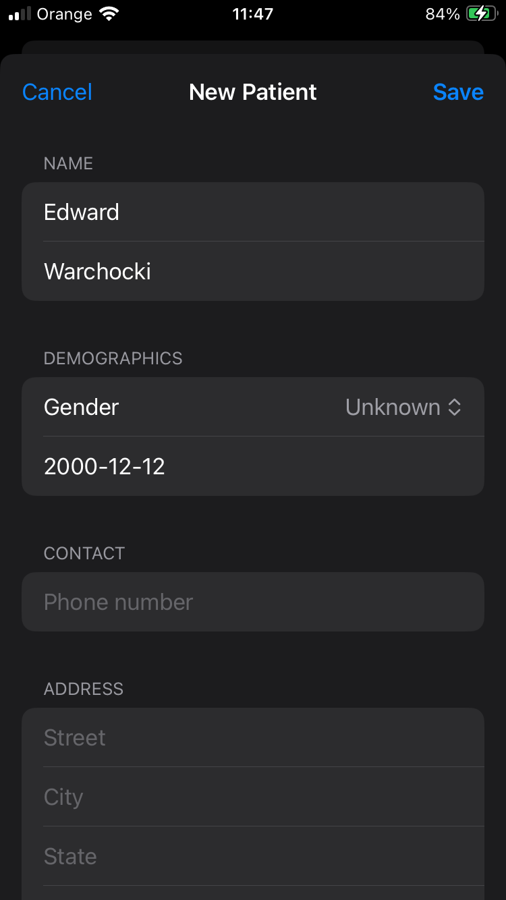
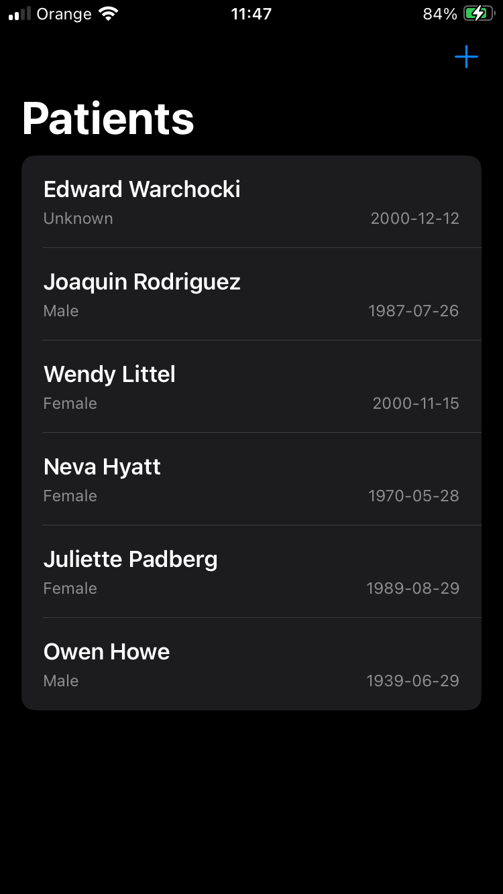

# FHIRDemo-SwiftUI
**iOS app for browsing, creating and deleting FHIR patients, and syncing Apple Health data as FHIR Observations**

***How to run the app***

No API key required. The app connects to the public SMART Health IT FHIR R4 test server.
Open the project in Xcode, select a real device or a simulator running iOS 17 or later, and hit Run.

HealthKit data (heart rate, step count) is only available on a physical device. On a simulator the app shows a warning banner and disables the sync UI.

⚠️ This is a shared public server — never enter real patient data.

***Features:***

* Browse a list of patients fetched from the FHIR server
* Create a new patient (name, gender, date of birth, phone, address)
* Delete a patient with swipe-to-delete
* View full patient details: identity, names, contact info, addresses
* Read today's heart rate and step count from Apple HealthKit
* Sync health data to the FHIR server as standardized Observations (LOINC codes)
* View today's synced heart rate and step count observations per patient

***API used:***

* r4.smarthealthit.org

***Tech stack:***

* Swift
* SwiftUI
* Async/await
* HealthKit

***Architectural Pattern:***

* MVVM with @Observable macro

***FHIR Standard:***

* HL7 FHIR R4
* Resources: Patient, Observation, Bundle
* Coding systems: LOINC (observation codes), UCUM (units of measure)

| Sync HealthKit data with FHIR server | Add new patient | Patients list |
|:---------:|:---------:|:---------:|
|  |  |  |